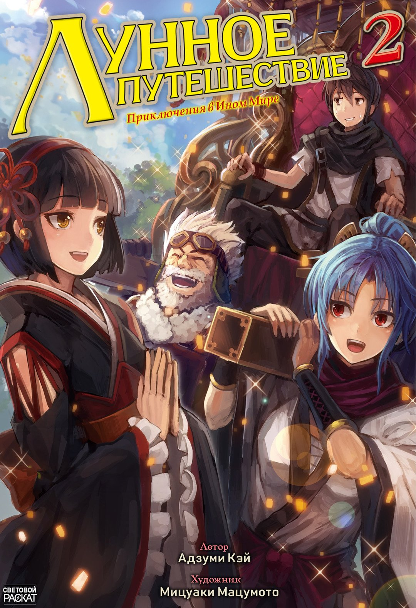
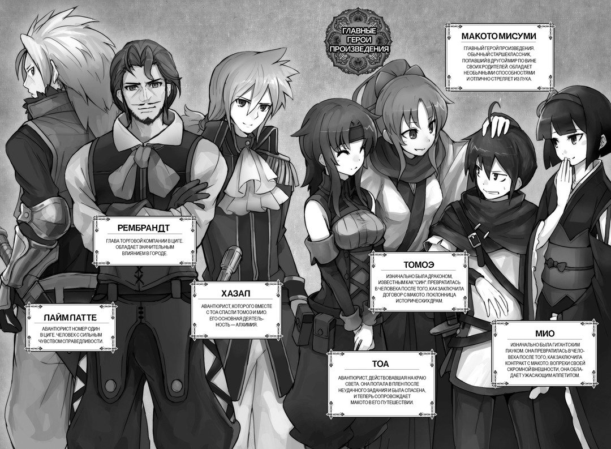
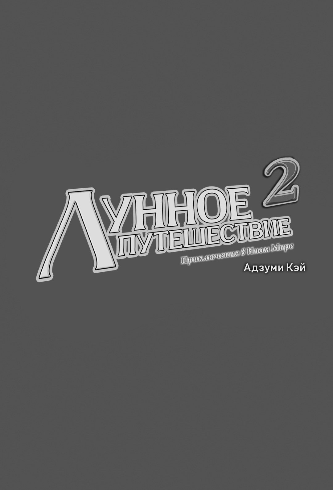
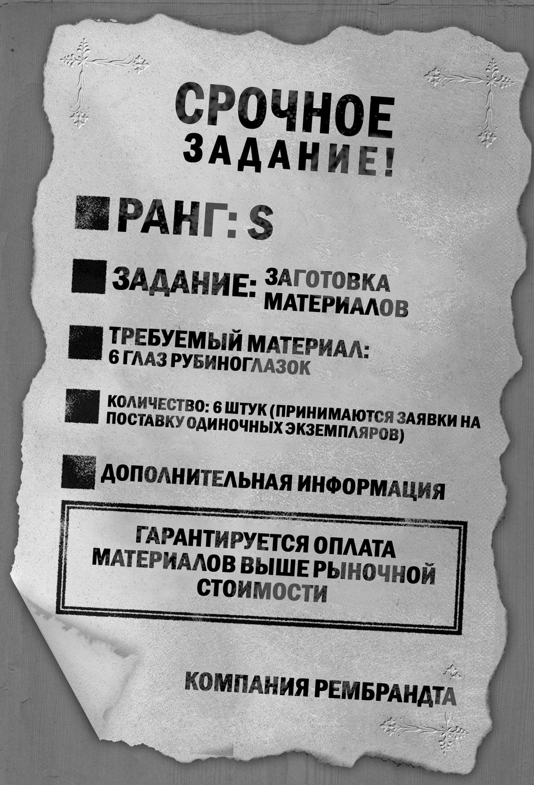
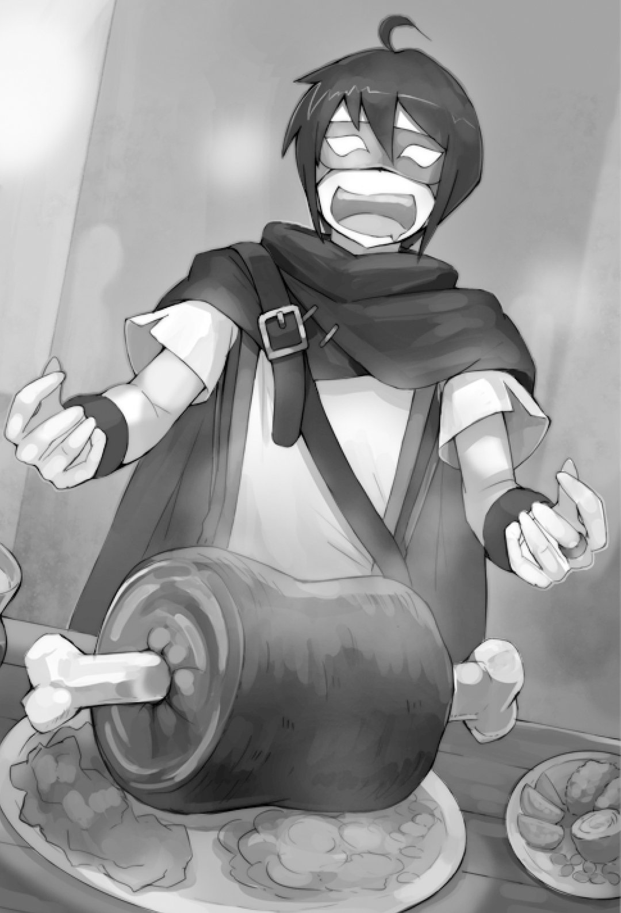
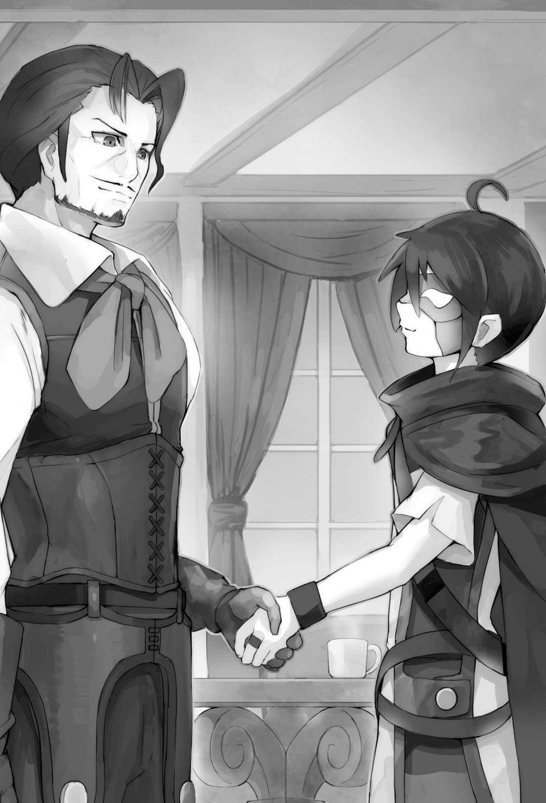
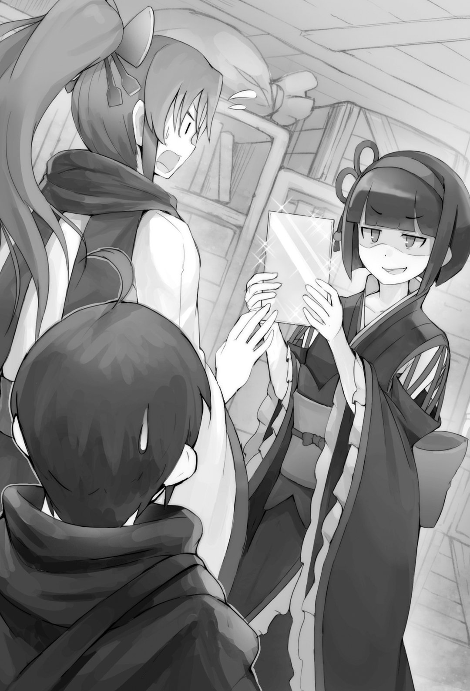
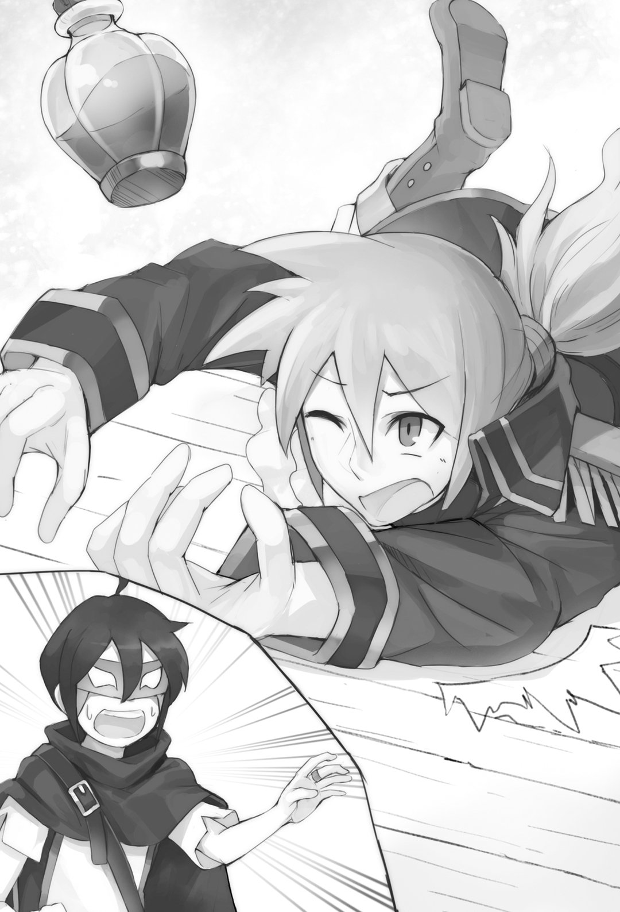
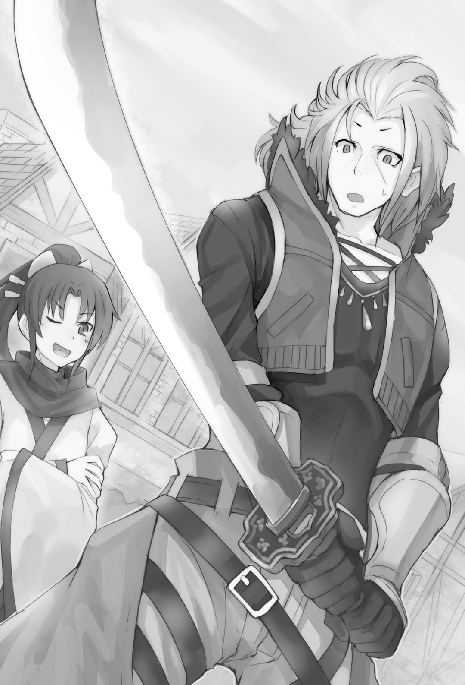
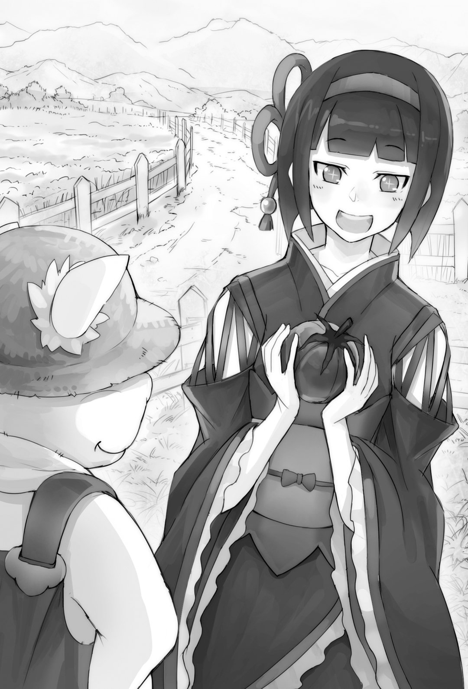

# Том 2

## 🎨 Иллюстрации

---

## 📚 Главы

- [Реквизиты переводчиков](chapter-01.md)
- [Вступительные иллюстрации:](chapter-02.md)
- [Пролог:](chapter-03.md)
- [Глава 1:](chapter-04.md)
- [Глава 2:](chapter-05.md)
- [Глава 3:](chapter-06.md)
- [Глава 4:](chapter-07.md)
- [Глава 5:](chapter-08.md)
- [Интерлюдия: Герой Лимии](chapter-09.md)
- [Интерлюдия: Герой Гритонии](chapter-10.md)
- [Побочная история: Рейтинг Подпространства](chapter-11.md)
- [Об авторе:](chapter-12.md)